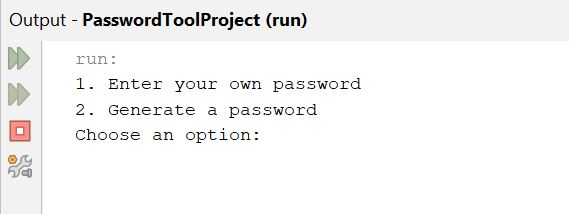

# Password Security Tool

Java application for password validation, strength analysis, and secure password generation.


## Overview

Password Security Tool is a Java console application that evaluates password strength and generates secure passwords using common password security best practices.

The project was developed after completing my first Java programming course and demonstrates fundamental programming concepts including methods, loops, arrays, conditionals, string manipulation, and input validation while applying them to a practical cybersecurity-related problem.

## Why I Built This

Strong passwords play an important role in protecting user accounts and systems. I created this project to strengthen my Java programming skills while applying basic password security concepts, including password length, character diversity, and common password detection.

Building this application also gave me experience designing a complete console application from planning and implementation to testing and documentation.

## Features

| Feature | Description |
|---------|-------------|
| Password Validation | Verifies passwords meet security requirements |
| Password Generator | Creates randomized passwords of user-selected length |
| Strength Analysis | Rates passwords as Weak, Medium, or Strong |
| Common Password Detection | Identifies frequently used passwords |
| Input Validation | Handles invalid user input gracefully |

## Technologies Used

- Java
- NetBeans IDE

## Concepts Demonstrated

- Java methods
- Conditional statements
- Loops
- Arrays
- String manipulation
- Character validation
- User input validation
- Random password generation
- Console-based applications

## How to Run

1. Clone or download the repository.
2. Open the project in NetBeans or another Java IDE.
3. Compile and run `PasswordTool.java`.
4. Follow the on-screen menu.

## Screenshots

### Main Menu

The application allows users to validate an existing password or generate a secure password.



---

### Password Generator

Example of a generated password that satisfies the application's security requirements.


## Project Structure

```text
password-security-tool
├── README.md
├── LICENSE
├── PasswordTool.java
└── screenshots/
    ├── menu.png
    └── example.png
```

## Future Enhancements

As I continue my Computer Information Systems coursework, I plan to enhance this project by exploring cryptographically secure random number generation, external configuration files, automated testing, and a graphical user interface.

## Author

**Breanna Ruckle**

Computer Information Systems Student

Southeast Missouri State University

## License

This project is licensed under the MIT License. See the `LICENSE` file for details.
