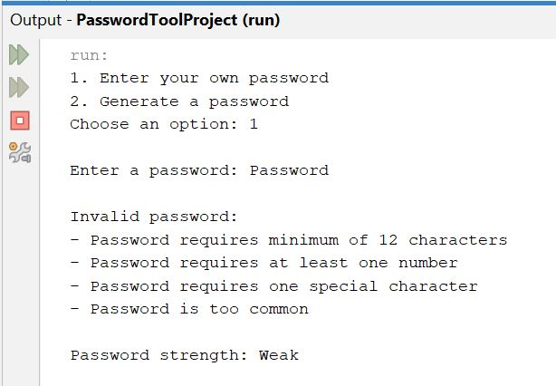

# Password Security Tool

Java application for password validation, strength analysis, and secure password generation.

## Overview

This project was developed after completing my first Java programming course. It demonstrates core Java programming concepts by allowing users to either validate the strength of a password or generate a random password that meets common security requirements.

## Features

- Validate user-created passwords
- Generate random passwords
- Password strength scoring (Weak, Medium, Strong)
- Minimum length requirement (12 characters)
- Uppercase letter detection
- Lowercase letter detection
- Number detection
- Special character detection
- Common password detection
- Input validation

## Technologies Used

- Java
- NetBeans IDE

## Skills Demonstrated

- Methods
- Loops
- Conditionals
- Arrays
- String manipulation
- Random password generation
- User input validation
- Console application development

## How to Run

1. Clone or download the repository.
2. Open the project in NetBeans or another Java IDE.
3. Compile and run `PasswordTool.java`.
4. Follow the on-screen menu.

## Screenshots

### Main Menu

### Password Generator Example

## Future Improvements

As I continue my Computer Information Systems coursework, I plan to enhance this project by exploring cryptographically secure random number generation, external configuration files, automated testing, and a graphical user interface.

## Author

Breanna Ruckle
